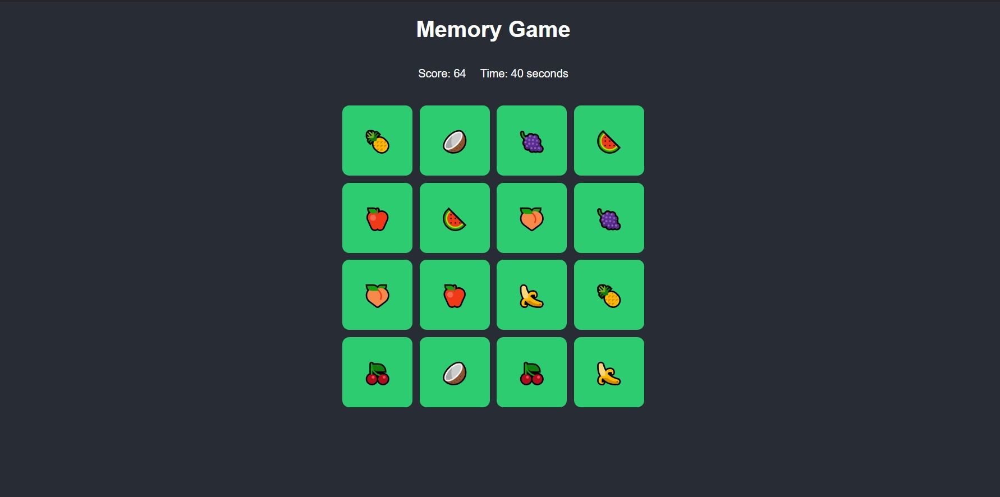

# Memory Game 🃏

A fun, interactive memory card-flipping game built with HTML, CSS, and JavaScript! Test your memory by matching pairs of cards, while racing against the timer. Earn points for each match, but watch out – mismatches will cost you! This project is perfect for those learning JavaScript DOM manipulation, CSS animations, and responsive layouts.



## 📋 Game Features
- **Card Flipping Mechanics**: Flip cards to reveal symbols and find pairs.
- **Timer and Score Counter**: Challenge yourself with a built-in timer and earn points with each match.
- **Interactive Animations**: Smooth CSS animations make for a delightful user experience.

## 🛠️ Technologies Used
- **HTML**: Layout structure and elements
- **CSS**: Styling and card-flipping animations
- **JavaScript**: Game logic, timer, and score functionality

## 🚀 Getting Started

### Prerequisites
- A modern web browser (e.g., Chrome, Firefox, Edge)

### Installation
1. **Clone the Repository**:
    ```bash
    git clone https://github.com/yourusername/memory-game.git
    ```
2. **Navigate to the Project Directory**:
    ```bash
    cd memory-game
    ```
3. **Open `index.html`** in your browser to start playing!

## 📖 How to Play
1. Click on any card to flip it over and reveal its symbol.
2. Click on another card to find a matching pair.
3. If the symbols match, you earn points, and the cards stay flipped!
4. If the symbols don’t match, the cards flip back, and you lose points.
5. Match all pairs as quickly as possible to achieve a high score!

---

## Connect with Me

Feel free to connect with me on my other platforms for updates, queries, or collaborations!


- **GitHub**: [paul-srijan](https://github.com/paul-srijan)
- **LinkedIn**: [Srijan Paul](https://www.linkedin.com/in/srijan-paul-547354260/)
- **Email**: iampaulsrijan@gmail.com
- **twitter**:[Paul Srijan](https://x.com/iampaulsrijan)

---


## 🤝 Contributing
Contributions are welcome! Please fork the repository and make a pull request to contribute.

---

Enjoy playing and improving your memory! If you have any feedback or suggestions, feel free to open an issue.
